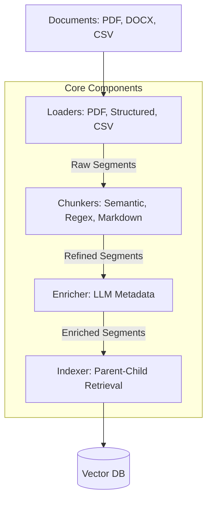

# rag-lib Developer's Guide

## 1. Overview

`rag-lib` is a specialized Python library designed for **Advanced RAG (Retrieval-Augmented Generation)** pipelines. Unlike generic RAG tools, `rag-lib` focuses on **hierarchical segmentation** and **layout-aware parsing**, ensuring that complex documents (PDFs with tables, DOCX with strict headers, huge CSVs) are preserved as meaningful "Segments" rather than arbitrary text chunks.

### Key Philosophy: The "Segment"

The atomic unit of `rag-lib` is the **Segment** (`rag_lib.core.domain.Segment`).

- **Not just text**: A Segment can be a `TABLE`, `IMAGE`, `AUDIO`, or `TEXT`.
- **Hierarchy aware**: Every Segment knows its `parent_id`, `level` (depth), and `path` (breadcrumbs like ["Chapter 1", "Section 1.2"]).
- **Metadata rich**: Segments carry extracted metadata (titles, keywords) and origin info.

---

## 2. Installation

### 2.1. Prerequisites

- **Python**: Version 3.9 or higher.
- **System Tools**:
  - **Poppler**: Required for PDF parsing.
    - _Windows_: Download binary, add `bin/` to PATH.
    - _Linux_: `sudo apt-get install poppler-utils`
    - _Mac_: `brew install poppler`
  - **Ghostscript**: Required for `camelot-py` (Table extraction).
    - _Windows_: Install from official site.
    - _Linux_: `sudo apt-get install ghostscript`

### 2.2. Install from Source

Cloning the repository and installing in editable mode is recommended for development.

```bash
git clone https://github.com/your-org/rag-lib.git
cd rag-lib
pip install -e .
```

### 2.3. Install via Pip (Wheel)

If building a wheel:

```bash
pip install dist/rag_lib-0.1.0-py3-none-any.whl
```

### 2.4. Verify Installation

```bash
python -c "import rag_lib; print(rag_lib.__version__)"
```

---

## 3. Architecture



---

## 4. Core Components

### 4.1. Loaders (`rag_lib.loaders`)

Responsible for ingesting raw files and producing initial Segments.

| Class                      | Import Path                    | Description                                                                                                  |
| :------------------------- | :----------------------------- | :----------------------------------------------------------------------------------------------------------- |
| **`PDFLoader`**            | `rag_lib.loaders.pdf`          | Uses **Camelot** (lattice/stream) or **Poppler** to extract text and high-fidelity tables from PDFs.         |
| **`StructuredLoader`**     | `rag_lib.loaders.structured`   | Parses **DOCX** files, preserving hierarchy based on Heading styles. Supports regex-based sub-splitting.     |
| **`CSVLoader`**            | `rag_lib.loaders.csv_excel`    | Loads **CSV** files. Detects delimiters automatically and converts rows to Markdown tables.                  |
| **`ExcelLoader`**          | `rag_lib.loaders.csv_excel`    | Loads **Excel** files, treating each sheet as a segment.                                                     |
| **`RegexHierarchyLoader`** | `rag_lib.loaders.regex`        | Splits plain text files using a recursive list of regex patterns (e.g., Log files, Configs).                 |
| **`TableLoader`**          | `rag_lib.loaders.data_loaders` | Generic loader for structured tabular data (CSV/JSON). Supports "Row" mode (key-value text) or "Group" mode. |
| **`JsonLoader`**           | `rag_lib.loaders.data_loaders` | Loads JSON files. Supports **jq-style** schema selection to target specific lists or dicts.                  |
| **`QALoader`**             | `rag_lib.loaders.data_loaders` | Parses "Q: ... A: ..." formatted text files into QA segments.                                                |

### 4.2. Chunkers (`rag_lib.chunkers`)

Refine raw segments into optimally sized units for retrieval.

| Class                                | Import Path                       | Description                                                                               |
| :----------------------------------- | :-------------------------------- | :---------------------------------------------------------------------------------------- |
| **`SemanticChunker`**                | `rag_lib.chunkers.semantic`       | Splits text based on **cosine similarity** of sentence embeddings (detects topic shifts). |
| **`RecursiveCharacterTextSplitter`** | `rag_lib.chunkers.recursive`      | Standard recursive splitting (paragraphs -> sentences -> words) to fit chunk size.        |
| **`TokenTextSplitter`**              | `rag_lib.chunkers.token`          | Splits text based on **token count** (using `tiktoken`) rather than characters.           |
| **`SentenceSplitter`**               | `rag_lib.chunkers.sentence`       | Uses **NLTK** to split by true sentences, grouping them until chunk size is reached.      |
| **`RegexSplitter`**                  | `rag_lib.chunkers.regex`          | Splits text based on a provided regex pattern.                                            |
| **`MarkdownTableSplitter`**          | `rag_lib.chunkers.markdown_table` | Extracts Markdown tables from text to ensure they remain intact as distinct segments.     |

### 4.3. Processors (`rag_lib.processors`)

Enhance segments with additional intelligence.

| Class                 | Import Path                   | Description                                                                          |
| :-------------------- | :---------------------------- | :----------------------------------------------------------------------------------- |
| **`SegmentEnricher`** | `rag_lib.processors.enricher` | Uses an LLM to generate **Title**, **Keywords**, and a **Summary** for each segment. |

### 4.4. Indexer (`rag_lib.core.indexer`)

The bridge to your Vector Database.

- **`Indexer`**: Implements **Parent-Child Indexing**.
  - If a segment has a `summary` (from Enricher), it embeds the summary (Semantic Key) but stores the full content in the payload.
  - Supports both `index()` (sync) and `aindex()` (async).

---

## 5. Retrieval Components (`rag_lib.retrieval`)

`rag-lib` provides advanced retrieval strategies beyond simple similarity search.

### 5.1. Retrievers

| Class/Factory              | Import Path                    | Description                                                                 |
| :------------------------- | :----------------------------- | :-------------------------------------------------------------------------- |
| **`get_vector_retriever`** | `rag_lib.retrieval.retrievers` | Standard dense vector retrieval (Similarity, MMR, Score Threshold).         |
| **`get_bm25_retriever`**   | `rag_lib.retrieval.retrievers` | **BM25** (Sparse) retrieval for keyword matching. (In-memory).              |
| **`RegexRetriever`**       | `rag_lib.retrieval.retrievers` | Finds documents matching a specific **Regex Pattern** (good for IDs/Codes). |
| **`FuzzyRetriever`**       | `rag_lib.retrieval.retrievers` | Uses **Levenshtein Distance** (RapidFuzz) for fuzzy string matching.        |

### 5.2. Composition & Reranking

Located in `rag_lib.retrieval.composition`.

| Helper Function                     | Description                                                                                                                                       |
| :---------------------------------- | :------------------------------------------------------------------------------------------------------------------------------------------------ |
| **`create_ensemble_retriever`**     | Combines multiple retrievers (e.g., BM25 + Vector) using **Reciprocal Rank Fusion (RRF)**.                                                        |
| **`create_reranking_retriever`**    | Wraps a retriever with a **Cross-Encoder** (e.g., BGE-Reranker) to re-score and filter the top-N results.                                         |
| **`create_dual_storage_retriever`** | Sets up a **Multi-Vector** system: Searches low-dim vectors/summaries, but retrieves full documents from a separate Store (e.g., Redis/Postgres). |

---

## 6. Usage Examples

### 6.1. Ingesting a Complex PDF with Tables

```python
from rag_lib.loaders.pdf import PDFLoader
from rag_lib.summarizers.table_llm import LLMTableSummarizer

# 1. Setup Table Summarizer (Optional)
summarizer = LLMTableSummarizer(llm=my_langchain_llm)

# 2. Load PDF
loader = PDFLoader(
    file_path="financial_report.pdf",
    backend="lattice",  # Use 'lattice' for grid tables
    summarizer=summarizer
)

segments = loader.load()

# resulting 'segments' list contains Table Segments (Markdown) and Text Segments.
```

### 6.2. Semantic Chunking & Indexing

```python
from rag_lib.chunkers.semantic import SemanticChunker
from rag_lib.processors.enricher import SegmentEnricher
from rag_lib.core.indexer import Indexer

# 1. Chunk Text Semantically
chunker = SemanticChunker(embeddings=my_embeddings, threshold=0.75)
text_segments = chunker.split_text(raw_text) # Returns list of Segments

# 2. Enrich Segments (Generate Titles/Keywords)
enricher = SegmentEnricher(llm=my_chat_model)
idx = Indexer(vector_store=my_vector_store, embeddings=my_embeddings, enricher=enricher)

# 3. Index (Enrichment happens automatically inside indexer)
idx.index(text_segments, batch_size=50)
```

### 6.3. Hierarchical DOCX Parsing

```python
from rag_lib.loaders.structured import StructuredLoader

# Define Regex Patterns for custom sections (optional)
patterns = [
    {"level": 2, "pattern": r"^Article \d+"}, # Treat "Article X" as Level 2 functionality
]

loader = StructuredLoader("contract.docx", regex_patterns=patterns)
segments = loader.load()

# Inspect hierarchy
for seg in segments:
    print(f"[{seg.level}] {seg.path} -> {seg.content[:30]}...")
```

---

## 7. Configuration & Dependencies

`rag-lib` relies on `rag_lib.config.Settings` (Pydantic) for global defaults:

- `ingestion.chunk_size`: Default CSV chunk size.
- `ingestion.semantic_threshold`: Default similarity threshold.
- `logging.level`: Global log level (INFO/DEBUG).

**Key Dependencies**:

- `camelot-py[cv]`: PDF Table extraction.
- `langchain-core`: Abstractions for LLMs and Embeddings.
- `pandas`: DataFrame operations.
- `nltk`: Sentence tokenization.

## 8. Extending the Library

To add a new Loader:

1.  Create `src/rag_lib/loaders/my_loader.py`.
2.  Implement a class with a `load(self) -> List[Segment]` method.
3.  Ensure you generate standard `Segment` objects with `uuid` and `type`.

To add a new Chunker:

1.  Inherit from `rag_lib.chunkers.base.TextSplitter` (if text-based).
2.  Implement `split_text(self, text: str) -> List[str]`.

---

## 9. Graph RAG Extensions

`rag-lib` 0.2.0+ introduces **Graph RAG** capabilities, inspired by _LightRAG_. This allows for entity-centric retrieval and global summarization.

### 9.1. Components (`rag_lib.graph`)

| Component                     | Description                                                            |
| :---------------------------- | :--------------------------------------------------------------------- |
| **`GraphNode` / `GraphEdge`** | Domain models for graph entities and relationships.                    |
| **`NetworkXGraphStore`**      | In-memory graph storage (default). Good for prototyping.               |
| **`Neo4jGraphStore`**         | Persistent graph storage adapter for Neo4j. Requires `rag-lib[graph]`. |

### 9.2. Processors

| Component                 | Description                                                                                                                               |
| :------------------------ | :---------------------------------------------------------------------------------------------------------------------------------------- |
| **`EntityExtractor`**     | LLM-based processor that extracts Entities and Relations from Segments and populates the GraphStore. Supports **Async Batch Processing**. |
| **`CommunityDetector`**   | Identifies communities (clusters) of nodes in the graph using modularity algorithms.                                                      |
| **`CommunitySummarizer`** | Generates high-level summaries for each detected community.                                                                               |

### 9.3. Retrieval

**`GraphRetriever`** supports two modes:

1.  **Local Mode** (`mode="local"`):
    - Implementation: Searches for specific entities (keywords) and traverses 1-hop or 2-hop neighbors.
    - Use Case: Specific questions about an entity (e.g., "Who follows user X?").

2.  **Global Mode** (`mode="global"`):
    - Implementation: Retrieves **Community Summaries** from the Vector Store.
    - Use Case: High-level thematic questions (e.g., "What are the main topics discussed?").

### 9.4. Example Usage

```python
from rag_lib.graph.store import NetworkXGraphStore
from rag_lib.processors.entity_extractor import EntityExtractor
from rag_lib.retrieval.graph_retriever import GraphRetriever

# 1. Setup
store = NetworkXGraphStore()
extractor = EntityExtractor(llm=my_llm, store=store)

# 2. Extract Graph
await extractor.aprocess_segments(segments)

# 3. Retrieve
retriever = GraphRetriever(store=store, mode="local")
docs = await retriever.ainvoke("Key Concept")
```

---

## 10. Advanced Loaders

### 10.1. MinerU (`rag_lib.loaders.miner_u`)

Integration with **Magic-PDF (MinerU)** for high-fidelity PDF parsing.

- **Purpose**: Extracts text, tables, and images while preserving layout information better than standard parsers.
- **Requirement**: `pip install rag-lib[miner_u]`
- **Class**: `MinerULoader`

```python
from rag_lib.loaders.miner_u import MinerULoader

loader = MinerULoader("complex_layout.pdf")
segments = loader.load()
# Returns typed Segments (TEXT, TABLE, IMAGE)
```
