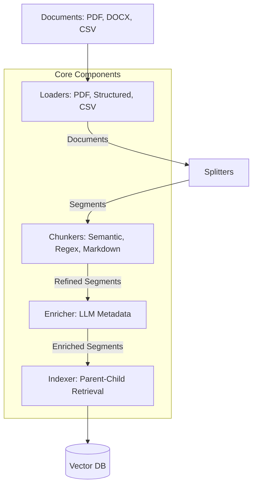

# rag-lib Developer's Guide

## 1. Overview

`rag-lib` is a specialized Python library designed for **Advanced RAG (Retrieval-Augmented Generation)** pipelines. Unlike generic RAG tools, `rag-lib` focuses on **hierarchical segmentation** and **layout-aware parsing**, ensuring that complex documents (PDFs with tables, DOCX with strict headers, huge CSVs) are preserved as meaningful "Segments" rather than arbitrary text chunks.

### Key Philosophy: The "Segment"

The atomic unit of `rag-lib` is the **Segment** (`rag_lib.core.domain.Segment`).

- **Not just text**: A Segment can be a `TABLE`, `IMAGE`, `AUDIO`, or `TEXT`.
- **Hierarchy aware**: Every Segment knows its `parent_id`, `level` (depth), and `path` (breadcrumbs like ["Chapter 1", "Section 1.2"]).
- **Metadata rich**: Segments carry extracted metadata (titles, keywords) and origin info.

---

## 2. Installation

### 2.1. Prerequisites

- **Python**: Version 3.9 or higher.
- **System Tools**:
  - **Poppler**: Required for PDF parsing.
    - _Windows_: Download binary, add `bin/` to PATH.
    - _Linux_: `sudo apt-get install poppler-utils`
    - _Mac_: `brew install poppler`
  - **Ghostscript**: Required for `camelot-py` (Table extraction).
    - _Windows_: Install from official site.
    - _Linux_: `sudo apt-get install ghostscript`

### 2.2. Install from Source

Cloning the repository and installing in editable mode is recommended for development.

```bash
git clone https://github.com/your-org/rag-lib.git
cd rag-lib
pip install -e .
```

### 2.3. Install via Pip (Wheel)

If building a wheel:

```bash
pip install dist/rag_lib-0.1.0-py3-none-any.whl
```

### 2.4. Verify Installation

```bash
python -c "import rag_lib; print(rag_lib.__version__)"
```

---

## 3. Architecture



---

## 4. Core Components

### 4.1. Loaders (`rag_lib.loaders`)

Responsible for ingesting raw files and producing standard **LangChain Documents**.

| Class                      | Import Path                    | Description                                                                                                  |
| :------------------------- | :----------------------------- | :----------------------------------------------------------------------------------------------------------- |
| **`PDFLoader`**            | `rag_lib.loaders.pdf`          | Uses **Camelot** (lattice/stream) or **Poppler** to extract text and high-fidelity tables from PDFs.         |
| **`DocXLoader`**           | `rag_lib.loaders.docx`         | Parses **DOCX** files into a single **Markdown** document, preserving headings/lists/links/tables.          |
| **`CSVLoader`**            | `rag_lib.loaders.csv_excel`    | Loads **CSV** files. Detects delimiters automatically and converts rows to Markdown tables.                  |
| **`ExcelLoader`**          | `rag_lib.loaders.csv_excel`    | Loads **Excel** files, treating each sheet as a segment.                                                     |
| **`RegexHierarchyLoader`** | `rag_lib.loaders.regex`        | Splits plain text files using a recursive list of regex patterns (e.g., Log files, Configs).                 |
| **`TableLoader`**          | `rag_lib.loaders.data_loaders` | Generic loader for structured tabular data (CSV/JSON). Supports "Row" mode (key-value text) or "Group" mode. |
| **`JsonLoader`**           | `rag_lib.loaders.data_loaders` | Loads entire JSON file content into a single **Document**.                                                   |
| **`QALoader`**             | `rag_lib.loaders.data_loaders` | Parses "Q: ... A: ..." formatted text files into QA segments.                                                |

### 4.2. Splitters & Chunkers (`rag_lib.chunkers`)

Refine raw Documents into Segments (Structure) or Segments into Chunks (Size).

- **`split_documents(docs)`**: Converts Documents -> Segments (Logical Splitting).
- **`split_segments(segs)`**: Converts Segments -> Chunks (Token/Character limitation).

| Class                                | Import Path                        | Description                                                                                |
| :----------------------------------- | :--------------------------------- | :----------------------------------------------------------------------------------------- |
| **`JsonSplitter`**                   | `rag_lib.chunkers.json`            | Splits JSON content based on **jq-style** schema (e.g., extracting items from a list).     |
| **`QASplitter`**                     | `rag_lib.chunkers.qa`              | Splits text containing "Q: ... A: ..." pairs into distinct Question/Answer segments.       |
| **`RegexHierarchySplitter`**         | `rag_lib.chunkers.regex_hierarchy` | Splits text recursively using a list of regex patterns (e.g. Log levels, Config sections). |
| **`SemanticChunker`**                | `rag_lib.chunkers.semantic`        | Splits text based on **cosine similarity** of sentence embeddings (detects topic shifts).  |
| **`RecursiveCharacterTextSplitter`** | `rag_lib.chunkers.recursive`       | Standard recursive splitting (paragraphs -> sentences -> words) to fit chunk size.         |
| **`TokenTextSplitter`**              | `rag_lib.chunkers.token`           | Splits text based on **token count** (using `tiktoken`) rather than characters.            |
| **`SentenceSplitter`**               | `rag_lib.chunkers.sentence`        | Uses **NLTK** to split by true sentences, grouping them until chunk size is reached.       |
| **`RegexSplitter`**                  | `rag_lib.chunkers.regex`           | Splits text based on a provided regex pattern.                                             |
| **`MarkdownTableSplitter`**          | `rag_lib.chunkers.markdown_table`  | Extracts Markdown tables from text to ensure they remain intact as distinct segments.      |

### 4.3. Processors (`rag_lib.processors`)

Enhance segments with additional intelligence.

| Class                 | Import Path                   | Description                                                                          |
| :-------------------- | :---------------------------- | :----------------------------------------------------------------------------------- |
| **`SegmentEnricher`** | `rag_lib.processors.enricher` | Uses an LLM to generate **Title**, **Keywords**, and a **Summary** for each segment. |

### 4.4. Indexer (`rag_lib.core.indexer`)

The bridge to your Vector Database.

- **`Indexer`**: Implements **Parent-Child Indexing**.
  - If a segment has a `summary` (from Enricher), it embeds the summary (Semantic Key) but stores the full content in the payload.
  - Supports both `index()` (sync) and `aindex()` (async).

---

## 5. Retrieval Components (`rag_lib.retrieval`)

`rag-lib` provides advanced retrieval strategies beyond simple similarity search.

### 5.1. Retrievers

| Class/Factory                    | Import Path                          | Description                                                                                                        |
| :------------------------------- | :----------------------------------- | :----------------------------------------------------------------------------------------------------------------- |
| **`create_vector_retriever`**    | `rag_lib.retrieval.retrievers`       | Standard dense vector retrieval (Similarity, MMR, Score Threshold).                                                |
| **`create_bm25_retriever`**      | `rag_lib.retrieval.retrievers`       | **BM25** (Sparse) retrieval for keyword matching. (In-memory).                                                     |
| **`RegexRetriever`**             | `rag_lib.retrieval.retrievers`       | Finds documents matching a specific **Regex Pattern** (good for IDs/Codes).                                        |
| **`FuzzyRetriever`**             | `rag_lib.retrieval.retrievers`       | Uses **Levenshtein Distance** (RapidFuzz) for fuzzy string matching.                                               |
| **`ScoredMultiVectorRetriever`** | `rag_lib.retrieval.scored_retriever` | Multi-Vector Retriever that aggregates similarity scores (MAX) from chunks to parents. Supports `score_threshold`. |

### 5.2. Composition & Reranking

Located in `rag_lib.retrieval.composition`.

| Helper Function                            | Description                                                                                                                                       |
| :----------------------------------------- | :------------------------------------------------------------------------------------------------------------------------------------------------ |
| **`create_ensemble_retriever`**            | Combines multiple retrievers (e.g., BM25 + Vector) using **Reciprocal Rank Fusion (RRF)**.                                                        |
| **`create_reranking_retriever`**           | Wraps a retriever with a **Cross-Encoder** (e.g., BGE-Reranker) to re-score and filter the top-N results.                                         |
| **`create_dual_storage_retriever`**        | Sets up a **Multi-Vector** system: Searches low-dim vectors/summaries, but retrieves full documents from a separate Store (e.g., Redis/Postgres). |
| **`create_scored_dual_storage_retriever`** | Same as above, but returns `ScoredMultiVectorRetriever` which injects aggregated relevance scores into parent metadata.                           |

---

## 6. Usage Examples

### 6.1. Ingesting a Complex PDF with Tables

```python
from rag_lib.loaders.pdf import PDFLoader
from rag_lib.summarizers.table_llm import LLMTableSummarizer

# 1. Setup Table Summarizer (Optional)
summarizer = LLMTableSummarizer(llm=my_langchain_llm)

# 2. Load PDF
    summarizer=summarizer
)

docs = loader.load()

# 3. Create Segments
# Since each doc is a table (in table mode) or text, we can wrap them into Segments
# or split them further.
from rag_lib.chunkers.token import TokenTextSplitter
splitter = TokenTextSplitter(chunk_size=1000)
segments = splitter.split_documents(docs)

# resulting 'segments' list contains typed Segments.
```

### 6.2. Semantic Chunking & Indexing

```python
from rag_lib.chunkers.semantic import SemanticChunker
from rag_lib.processors.enricher import SegmentEnricher
from rag_lib.core.indexer import Indexer

# 1. Chunk Text Semantically
chunker = SemanticChunker(embeddings=my_embeddings, threshold=0.75)
text_segments = chunker.create_segments(raw_text) # Returns list of Segments

# 2. Enrich Segments (Generate Titles/Keywords)
enricher = SegmentEnricher(llm=my_chat_model)
idx = Indexer(vector_store=my_vector_store, embeddings=my_embeddings, enricher=enricher)

# 3. Index (Enrichment happens automatically inside indexer)
idx.index(text_segments, batch_size=50)
```

### 6.3. Hierarchical DOCX Parsing

```python
from rag_lib.loaders.docx import DocXLoader
from rag_lib.chunkers.markdown_hierarchy import MarkdownHierarchySplitter

# Define Regex Patterns for custom sections (optional)
patterns = [
    {"level": 2, "pattern": r"^Article \d+"}, # Treat "Article X" as Level 2 functionality
]

loader = DocXLoader("contract.docx") # Regex patterns now applied in Splitter if using RegexHierarchySplitter
docs = loader.load()

# Split by Hierarchy
# Use MarkdownHierarchySplitter to parse the headers from the loaded Markdown
splitter = MarkdownHierarchySplitter()
segments = splitter.split_documents(docs)

# Inspect hierarchy
for seg in segments:
    print(f"[{seg.level}] {seg.path} -> {seg.content[:30]}...")
```

---

## 7. Configuration & Dependencies

`rag-lib` relies on `rag_lib.config.Settings` (Pydantic) for global defaults:

- `ingestion.chunk_size`: Default CSV chunk size.
- `ingestion.semantic_threshold`: Default similarity threshold.
- `logging.level`: Global log level (INFO/DEBUG).

**Key Dependencies**:

- `camelot-py[cv]`: PDF Table extraction.
- `langchain-core`: Abstractions for LLMs and Embeddings.
- `pandas`: DataFrame operations.
- `nltk`: Sentence tokenization.

## 8. Extending the Library

To add a new Loader:

1.  Create `src/rag_lib/loaders/my_loader.py`.
2.  Implement a class with a `load(self) -> List[Segment]` method.
3.  Ensure you generate standard `Segment` objects with `uuid` and `type`.

To add a new Chunker:

1.  Inherit from `rag_lib.chunkers.base.TextSplitter` (if text-based).
2.  Implement `split_text(self, text: str) -> List[str]`.

---

## 9. Graph RAG Extensions

`rag-lib` 0.2.0+ introduces **Graph RAG** capabilities, inspired by _LightRAG_. This allows for entity-centric retrieval and global summarization.

### 9.1. Components (`rag_lib.graph`)

| Component                     | Description                                                            |
| :---------------------------- | :--------------------------------------------------------------------- |
| **`GraphNode` / `GraphEdge`** | Domain models for graph entities and relationships.                    |
| **`NetworkXGraphStore`**      | In-memory graph storage (default). Good for prototyping.               |
| **`Neo4jGraphStore`**         | Persistent graph storage adapter for Neo4j. Requires `rag-lib[graph]`. |

### 9.2. Processors

| Component                 | Description                                                                                                                               |
| :------------------------ | :---------------------------------------------------------------------------------------------------------------------------------------- |
| **`EntityExtractor`**     | LLM-based processor that extracts Entities and Relations from Segments and populates the GraphStore. Supports **Async Batch Processing**. |
| **`CommunityDetector`**   | Identifies communities (clusters) of nodes in the graph using modularity algorithms.                                                      |
| **`CommunitySummarizer`** | Generates high-level summaries for each detected community.                                                                               |

### 9.3. Retrieval

`GraphRetriever` is strict and deterministic in this codebase (no silent fallbacks for missing capabilities).

**Constructor (current API):**

```python
GraphRetriever(
    vector_store,
    graph_store,
    config: GraphQueryConfig,
    embedder: Optional[Embeddings] = None,
    llm: Optional[BaseChatModel] = None,
    doc_store: Optional[BaseStore[str, Document]] = None,
    id_key: str = "segment_id",
)
```

#### 9.3.1. `GraphRetriever` Parameters

| Parameter      | Type                                 | Required | Default       | Description |
| :------------- | :----------------------------------- | :------- | :------------ | :---------- |
| `vector_store` | `VectorStore`                        | Yes      | -             | Primary vector backend. Required in strict mode for scoring + hydration (`similarity_search_with_relevance_scores`, `get_by_ids`, async equivalents). |
| `graph_store`  | `BaseGraphStore`                     | Yes      | -             | Graph backend with node/edge search, expansion, priors, and provenance methods. |
| `config`       | `GraphQueryConfig`                   | Yes      | -             | Retrieval strategy configuration (mode, thresholds, budgets, limits). |
| `embedder`     | `Embeddings \| None`                 | No       | `None`        | Optional embedding model passed to graph hybrid search methods. |
| `llm`          | `BaseChatModel \| None`              | No       | `None`        | Required when `enable_keyword_extraction=True`. Must support `with_structured_output(...)`. |
| `doc_store`    | `BaseStore[str, Document] \| None`   | No       | `None`        | Optional authoritative source for hydrated chunks (`mget`/`amget`). If absent, hydration uses `vector_store.get_by_ids`/`aget_by_ids`. |
| `id_key`       | `str`                                | No       | `"segment_id"` | Metadata key used as source id for hydration and provenance matching. |

#### 9.3.2. `GraphQueryConfig` Parameters

| Field | Type | Default | Description |
| :---- | :--- | :------ | :---------- |
| `mode` | `Literal["local", "global", "hybrid", "mix"]` | `"hybrid"` | Retrieval strategy mode. |
| `top_k_entities` | `int` | `12` | Max entity candidates used in scoring/assembly. |
| `top_k_relations` | `int` | `24` | Max relation/community candidates. |
| `top_k_chunks` | `int` | `10` | Max hydrated chunk candidates before final budgeting. |
| `max_hops` | `int` | `2` | Graph expansion depth from seeds (local/hybrid/mix). |
| `min_score` | `float` | `0.15` | Final score floor after rerank. Lower values increase recall/noise. |
| `use_rerank` | `bool` | `True` | Applies deterministic overlap rerank pass on final evidence. |
| `enable_keyword_extraction` | `bool` | `True` | If `True`, query keywords are extracted via `llm.with_structured_output(...)`. If `False`, deterministic lexical keywords are used. |
| `token_budget_total` | `int` | `3500` | Total evidence token budget for final assembly. |
| `token_budget_entities` | `int` | `700` | Token budget cap for entity evidence. |
| `token_budget_relations` | `int` | `900` | Token budget cap for relation evidence. |
| `token_budget_chunks` | `int` | `1900` | Token budget cap for chunk evidence. |

#### 9.3.3. Retrieval Modes

| Mode | Behavior | Best For |
| :--- | :------- | :------- |
| `local` | Entity-first seeding, bounded subgraph expansion, relation/entity scoring, chunk hydration from provenance ids. | Precise entity-centric questions. |
| `global` | Community + relation-first retrieval, then entity backfill, then hydration. | Thematic/high-level questions. |
| `hybrid` | Runs `local` + `global` in parallel, merges by Reciprocal Rank Fusion (RRF). | Balanced precision/recall (recommended default). |
| `mix` | `hybrid` + plain vector chunk retrieval, merged by RRF. | Maximum recall when graph coverage is incomplete. |

#### 9.3.4. Returned Document Metadata Contract

Each returned `Document` includes:

| Metadata Key | Description |
| :----------- | :---------- |
| `retrieval_kind` | One of: `chunk`, `entity`, `relation`, `community`. |
| `score` | Final normalized score (`0.0` to `1.0`). |
| `graph_mode` | Active mode: `local`, `global`, `hybrid`, `mix`. |
| `source_segment_id` | Provenance source id when available. |
| `entity_id` | Present when `retrieval_kind == "entity"`. |
| `edge_id` | Present when `retrieval_kind == "relation"`. |
| `community_id` | Present when `retrieval_kind == "community"`. |

#### 9.3.5. Strict Failure Semantics

`GraphRetriever` raises explicit exceptions instead of returning empty fallbacks for core capability failures:

- `GraphConfigurationError`: invalid config or missing required components.
- `GraphCapabilityError`: selected backend lacks required method.
- `GraphDataError`: backend returns invalid/unsupported payload shape.

### 9.4. Example Usage

```python
from langchain_openai import ChatOpenAI
from rag_lib.embeddings.factory import create_embeddings_model
from rag_lib.graph.store import NetworkXGraphStore
from rag_lib.processors.entity_extractor import EntityExtractor
from rag_lib.retrieval.graph_retriever import GraphQueryConfig, GraphRetriever
from rag_lib.vectors.factory import create_vector_store

# 1. Setup
store = NetworkXGraphStore()
extractor = EntityExtractor(llm=my_llm, store=store)
embeddings = create_embeddings_model(provider="openai", model_name="text-embedding-3-small")
vector_store = create_vector_store(
    provider="chroma",
    embeddings=embeddings,
    collection_name="graph_demo",
    cleanup=True,
)

# 2. Extract Graph
await extractor.aprocess_segments(segments)

# 3. Index source chunks for hydration
vector_store.add_texts(
    texts=[s.content for s in segments],
    metadatas=[{"segment_id": s.segment_id} for s in segments],
    ids=[s.segment_id for s in segments],
)

# 4. Retrieve (deterministic lexical keywords)
retriever = GraphRetriever(
    vector_store=vector_store,
    graph_store=store,
    config=GraphQueryConfig(
        mode="hybrid",
        max_hops=1,
        top_k_entities=8,
        top_k_relations=10,
        top_k_chunks=8,
        min_score=0.45,
        enable_keyword_extraction=False,
    ),
)
docs = retriever.invoke("Теория вероятности")
```

#### 9.4.1. Strict LLM Keyword Extraction Example

```python
llm = ChatOpenAI(model="gpt-4.1-nano", temperature=0)

retriever = GraphRetriever(
    vector_store=vector_store,
    graph_store=store,
    llm=llm,
    config=GraphQueryConfig(
        mode="mix",
        enable_keyword_extraction=True,  # uses llm.with_structured_output(...)
    ),
)

docs = retriever.invoke("Теория вероятности")
```

#### 9.4.2. Mode Preset Examples

```python
# Local (high precision, lower noise)
GraphQueryConfig(
    mode="local",
    max_hops=1,
    top_k_entities=6,
    top_k_relations=8,
    top_k_chunks=6,
    min_score=0.55,
)

# Global (relation/community-heavy)
GraphQueryConfig(
    mode="global",
    max_hops=1,
    top_k_entities=8,
    top_k_relations=12,
    top_k_chunks=6,
    min_score=0.45,
)

# Hybrid (balanced default)
GraphQueryConfig(
    mode="hybrid",
    max_hops=1,
    top_k_entities=8,
    top_k_relations=10,
    top_k_chunks=7,
    min_score=0.50,
)

# Mix (max recall)
GraphQueryConfig(
    mode="mix",
    max_hops=1,
    top_k_entities=6,
    top_k_relations=10,
    top_k_chunks=8,
    min_score=0.50,
)
```

---

## 10. Advanced Loaders

### 10.1. MinerU (`rag_lib.loaders.miner_u`)

Integration with **Magic-PDF (MinerU)** for high-fidelity PDF parsing.

- **Purpose**: Extracts text, tables, and images while preserving layout information better than standard parsers.
- **Requirement**: `pip install rag-lib[miner_u]`
- **Class**: `MinerULoader`

```python
from rag_lib.loaders.miner_u import MinerULoader

loader = MinerULoader("complex_layout.pdf")
segments = loader.load()
# Returns typed Segments (TEXT, TABLE, IMAGE)
```

---

## 11. RAPTOR (Recursive Abstractive Processing)

**RAPTOR** (`rag_lib.raptor`) is a technique for **hierarchical summarization**. It recursively clusters text segments and summarizes them to build a "tree" of information. This allows the system to answer high-level questions that span across many documents.

### 11.1. Installation & Environment (Crucial!)

RAPTOR relies on `umap-learn` for dimensionality reduction, which has complex dependencies (Numba, llvmlite).

> [!WARNING]
> **Avoid `uv sync` for RAPTOR**: `uv` often fails to build `numba` because it requires specific C++ compilers.

**Recommended Installation**:

1.  **Use `pip` explicitly** inside your virtual environment to get pre-built wheels:

    ```bash
    # Windows / Linux / Mac
    pip install umap-learn scikit-learn
    ```

2.  **Project Config**:
    To install via project extras (if `uv` supports wheels on your OS):

    ```bash
    pip install ".[raptor]"
    # OR
    uv sync --extra raptor
    ```

3.  **Troubleshooting**:
    If you see `ImportError: No module named 'umap'`, run the manual `pip install` command above.

### 11.2. Components

| Component               | Import Path                    | Description                                                                  |
| :---------------------- | :----------------------------- | :--------------------------------------------------------------------------- |
| **`ClusteringService`** | `rag_lib.raptor.clustering`    | Uses **UMAP** (dim reduction) + **GMM** (Gaussian Mixture) to cluster texts. |
| **`ClusterSummarizer`** | `rag_lib.raptor.summarization` | Summarizes a list of texts using an LLM.                                     |
| **`TreeBuilder`**       | `rag_lib.raptor.tree_builder`  | Orchestrates the recursive Level 0 -> Level N tree creation.                 |
| **`RaptorProcessor`**   | `rag_lib.processors.raptor`    | Main entry point. Wraps `TreeBuilder` into a standard Processor.             |

### 11.3. Example Usage

```python
from rag_lib.processors.raptor import RaptorProcessor
from rag_lib.raptor.clustering import ClusteringService
from langchain_openai import ChatOpenAI, OpenAIEmbeddings

# 1. Setup Components
llm = ChatOpenAI(model="gpt-4o")
embeddings = OpenAIEmbeddings()

# 2. Initialize Processor (Automatic Clustering Service)
raptor = RaptorProcessor(
    llm=llm,
    embeddings=embeddings,
    max_levels=3
)

# 3. Process Segments
# Input: List[Segment] (Level 0)
# Output: List[Segment] (Level 0 + Level 1 Summaries + Level 2 Summaries...)
enriched_segments = await raptor.aprocess(raw_segments)
```
